# PetConnect

**PetConnect** es una red social y plataforma integral diseñada para conectar a los amantes de los animales. El sistema permite a los usuarios gestionar los perfiles de sus mascotas, interactuar con otros dueños compartiendo publicaciones, establecer conexiones de amistad y, lo más importante, facilitar y gestionar de forma segura el proceso de adopción de mascotas.

## Características Principales

* Autenticación y Seguridad: Registro e inicio de sesión de usuarios.
* Gestión de Perfiles: Perfiles personalizables con avatares, información de contacto y biografía.
* Sistema de Amistades: Envío, aceptación y rechazo de solicitudes de amistad entre usuarios.
* Gestión de Mascotas: Registro completo de mascotas (especie, raza, edad, tamaño y fotos).
* Red Social: Feed interactivo donde los usuarios pueden subir fotos, descripciones y ubicación de sus mascotas.
* Plataforma de Adopciones:
  * Publicación de mascotas buscando hogar.
  * Peticiones de adopción gestionadas directamente entre los usuarios.
  * Transferencia automática de la propiedad de la mascota en la base de datos al aceptar una solicitud.

## Tecnologías Utilizadas

* Frontend: HTML, CSS, JavaScript.
* Backend: Node.js, Express.js.
* Base de Datos: PostgreSQL.
* Infraestructura & Herramientas: Docker & Docker Compose, Multer.

---

## Configuración y Ejecución del Sistema

### 1. Prerrequisitos
* Tener instalado Docker (https://www.docker.com/) y Docker Compose.
* Git para clonar el repositorio.

### 2. Clonar el repositorio
* poner los siguientes comandos:
* git clone https://github.com/ExequielTrangoni/Sobrevivientes-de-Camejo-TP.git
* cd Sobrevivientes-de-Camejo-TP.git (si es que no estamos ya en la carpeta).
* Crear un archivo .env con los siguientes datos:
    DB_USER=postgres
    DB_PASSWORD=tu_contraseña
    DB_NAME=petconnect_db
    DB_HOST=petconnect_db # El nombre del contenedor de la base de datos
    JWT_SECRET=super_seguro
    PORT=3000
* docker-compose build
* docker-compose up (se puede levantar front y backend separados pero de esta forma se levantan ambos)

---
## Finalización

* pagina web: http://localhost:8080
* backend: http://localhost:3000/api/
* PostgreSQL está corriendo internamente de forma invisible en el puerto 5432.

---

## INICIAR SESION/CREAR CUENTA :
    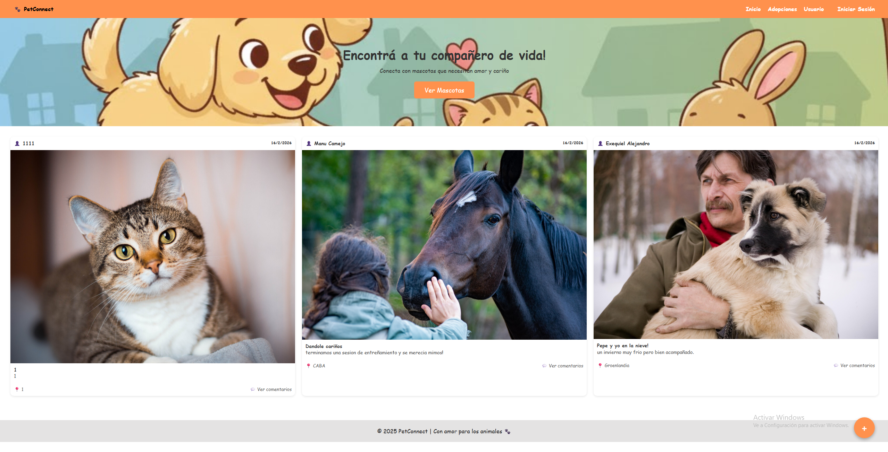
    Al acceder a la pagina en la esquina superior derecha podemos darle a "iniciar sesion" para acceder a nuestra cuenta.
    Una vez hacemos click vemos lo siguiente:
    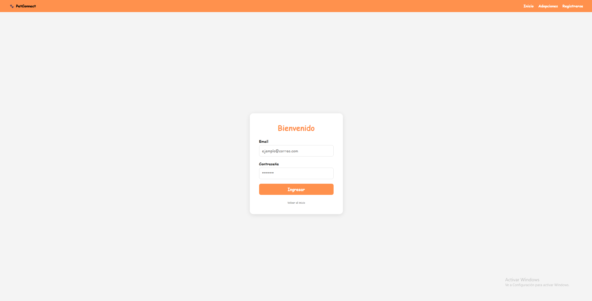
    ponemos nuestros datos o si no tenemos cuenta seleccionamos "Registrarse" apretando el boton de la esquina superior derecha.
    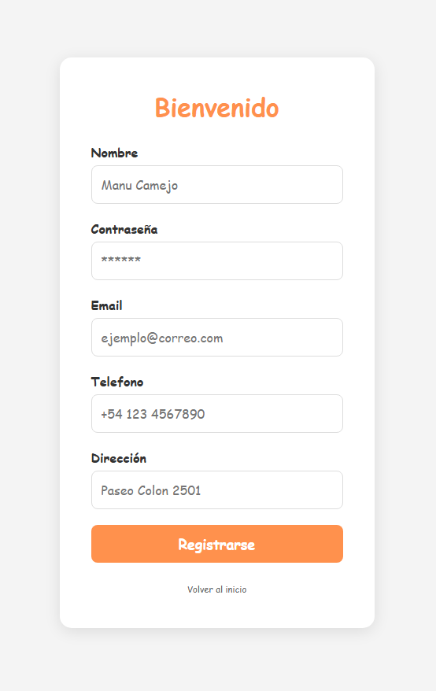
    completamos los datos y al dar a registrarse te llevara al inicio nuevamente.
## BARRA DE OPCIONES
    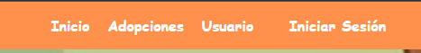
    En esta barra tenemos varios botones:
    Inicio: te lleva al inicio donde podes ver tu feed.
    Adopciones: te lleva a las publicaciones de mascotas en adopción.
    Usuario: te lleva a tu perfil.
    Si no estas logeado veras Iniciar Sesion.
    Si estas logeado veras Cerrar Sesion.
## AGREGAR MASCOTAS
    Para agregar una mascota deberemos ir a nuestro perfil y en el recuadro de "Mascotas" darle a "agregar mascota"
    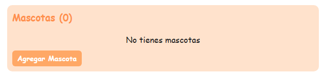
    Luego llenaremos los datos
    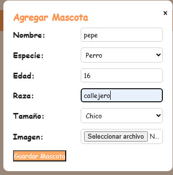
    y al darle a agregar mascota ya la tendremos en nuestro perfil
## CREAR PUBLICACION
    Podemos crear una publicación desde nuestro perfil, dandole al boton de "Agregar publicacion" o en el inicio dandole al boton flotante con un "+" en el inicio.
    deberemos llenar los datos y al dar "publicar" se publicará.
    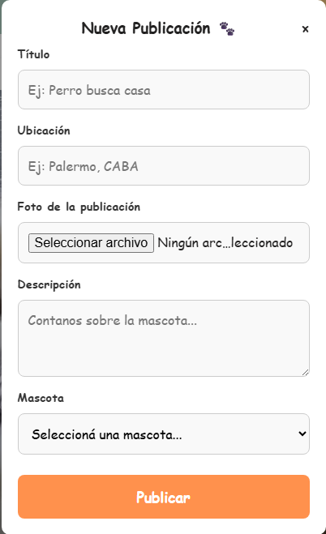
## AÑADIR AMIGO (ACEPTAR/RECHAZAR)
    Para añadir a un amigo deberemos ir al perfil de dicha persona y debajo de su foto de perfil aparecera un boton para añadirlo.
    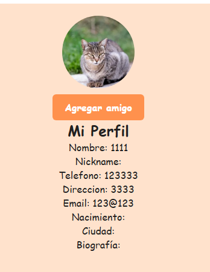
    Luego para aceptar o rechazar solicitudes entrantes deberas ir a tu perfil y debajo de "Solicitudes de amistad" te apareceran.
    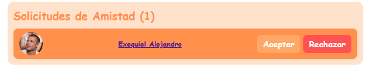
## CREAR ADOPCION
    Para poner una mascota en adopción deberás ir a la pestaña de "Adopciones" Clickear en "publicar mascota en adopción" y llenar los datos.
    Una vez publicado te aparecerá si alguien está interesado en la adopcion en tu perfil, donde dice "solicitudes de adopcion recibidas"
    y ahi podras aceptarlas o rechazarlas.
    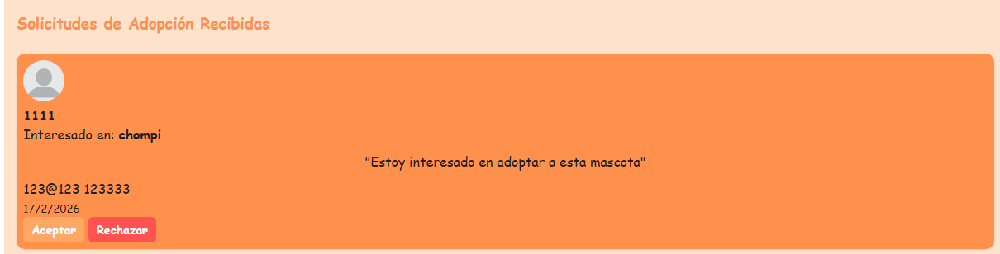
## ADOPTAR MASCOTA
    Para adoptar una mascota deberas ir a "adopciones", ver las mascotas disponibles y clickear en "adoptar" en la interesada.
    podras mandarle un mensaje al dueño y estaras a la espera de si acepta o la rechaza.
    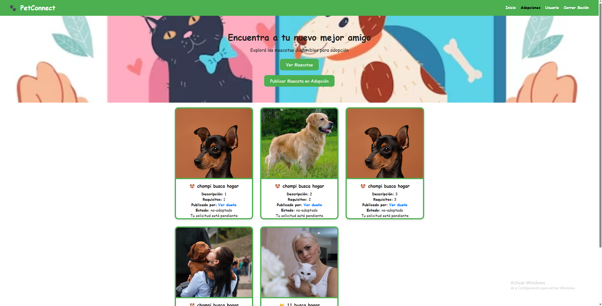